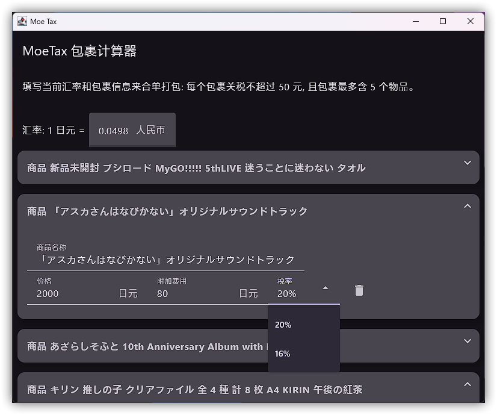
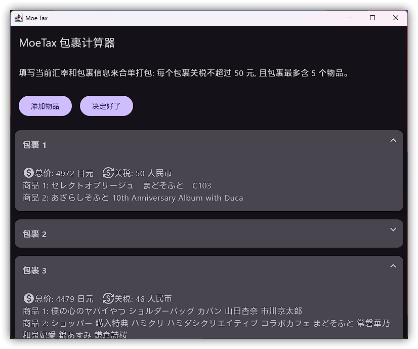
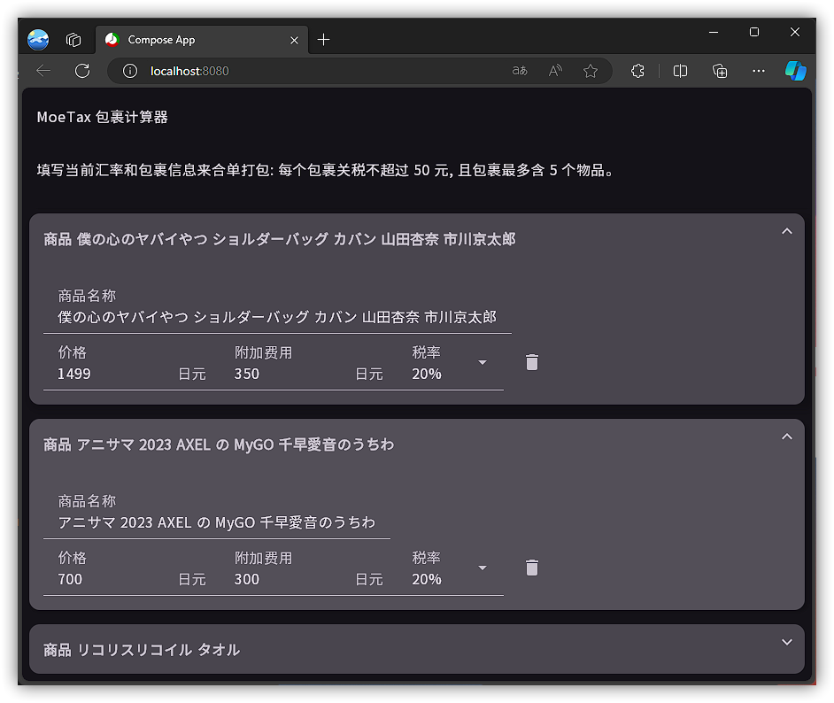
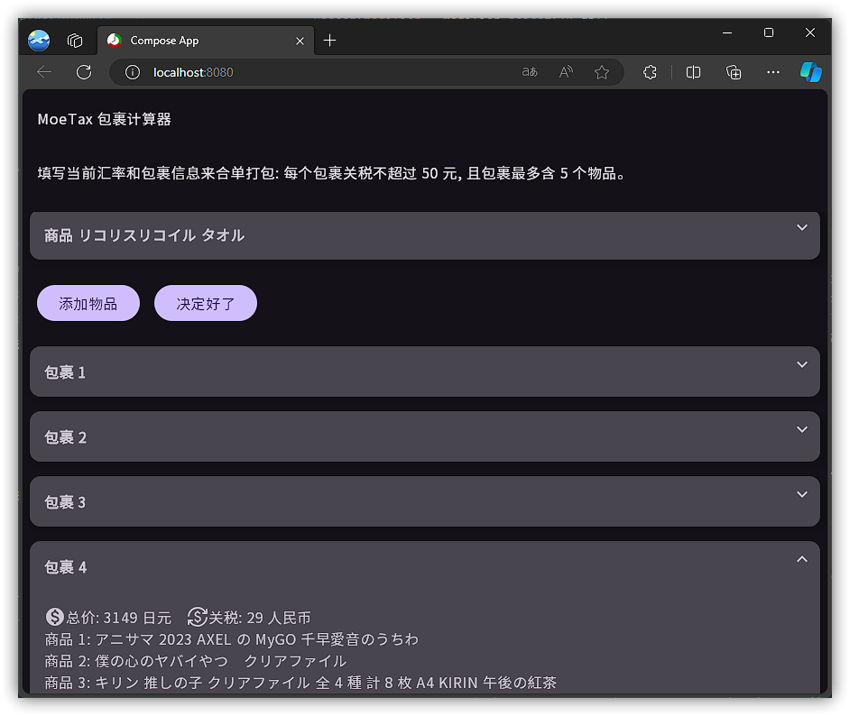
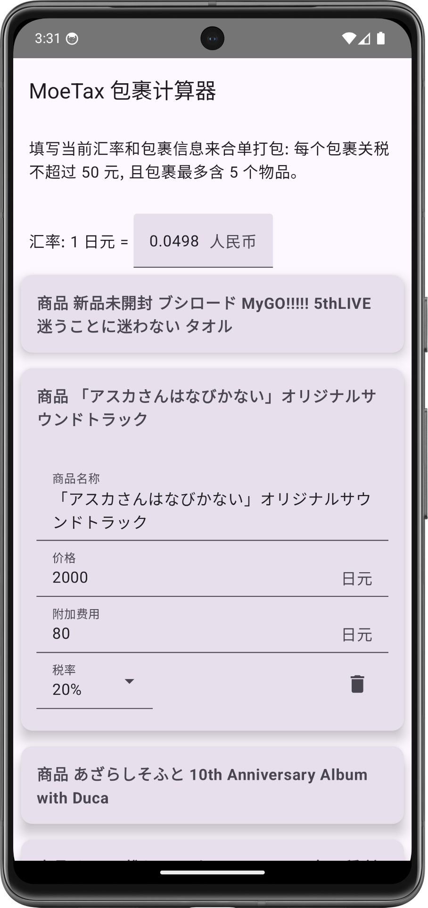
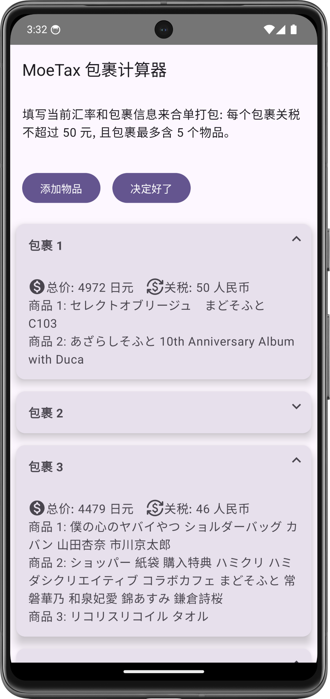

Kotlin Multiplatform
Knapsack solver targeting Android,
Web, iOS
and Desktop,
aiming for experience Compose Multiplatform.

**MoeTax**
是纯
Kotlin
背包问题求解器。它用于按要求打包包裹。使用户海淘了大量物品时，能够保证每个包裹的进口税小于或等于
50
人民币的免征税额度，一个包裹最多含
5
个物品，同时包裹的数量最少。输出各个包裹的内含物和关税值。方法可能不是最佳的。

## 背景

如果您时间紧，您可以跳过此部分。

集美
[高松灯](https://mzh.moegirl.org.cn/%E9%AB%98%E6%9D%BE%E7%81%AF)
特别羡慕初中生
[山田杏奈](https://mzh.moegirl.org.cn/%E5%B1%B1%E7%94%B0%E6%9D%8F%E5%A5%88)
的大仍子，所以特别喜欢购入
[我心危](https://mzh.moegirl.org.cn/%E6%88%91%E5%BF%83%E9%87%8C%E5%8D%B1%E9%99%A9%E7%9A%84%E4%B8%9C%E8%A5%BF)
的
[吧唧](https://www.bilibili.com/read/cv15559774)。但是
[海鲜市场](https://m.douban.com/group/topic/258829584/)
的倒🐶倒✌️实在太多了所以不收
[国现](https://regengbaike.com/59.html)。她比较怕生，很[不安](https://g.nga.cn/read.php?tid=26020604)，没有找
[煤炉代切](https://www.zhihu.com/question/485951222)，而是在软件上单机切煤，但是她把剩余的时间都用来做题、偷带手机在寝室里看日本
TV
动画或者在小红书上分享自己的
[朋克摇滚](https://www.bilibili.com/read/cv27620793/)。而且她只会
[天体力学](https://www.bilibili.com/read/cv9525202/)，摆弄石头以解决三体问题，并不怎么会计算进口税
(tariff)。

高松灯吃谷不多，也不会买什么
[冷捆热](https://www.zhihu.com/question/446339197)
和
[h 价谷](https://www.zhihu.com/question/292646747)，因此咪只会购买下面好价谷子：

- 单个商品的进口税小于等于
  50
  人民币。关税若有小于
  1
  人民币的余数
  `CNY 48.01`，均视为 1
  人民币。取整即
  `CNY 49.00`。

- 她购买的物品，品类要不就是收
  13%
  进口税，要不就是收
  20%
  进口税的。

- 完税金额
  (海关认定最低价)
  没有考虑，需要自己判断并填入；她看起来不会购买电子产品、
  3
  套以上的印刷品或音像制品。

- 她购买的商品都是可以过关的非
  R
  [清水本](https://baike.baidu.com/item/%E6%B8%85%E6%B0%B4%E6%96%87)
  等在列商品。

程序不需要计算海关认定最低价。需要她手动检查并输入商品价格。

由于她[住在鬼门关](https://tieba.baidu.com/p/8037301660)，选择
EMS
肯定会带来额外的进口税，而快递费本身也负担不起。她很害怕。就这些垃圾屋捡来的小垃圾，为什么要花时间弄报关呢。因此她只能选择使用
[代清关物流](https://www.zhihu.com/answer/1285774474)
或者
[阳光报税物流](https://www.zhihu.com/question/301845038/answer/1282252015)
。但是代清关小包能发的东西不多。比如她想购买一张
[MyGO!!!!!
1st
Album「迷跡波」【通常盤】](https://bang-dream.com/discographies/3457)，但被告知
CD
不能经手代清关。

因此辗转反侧后她决定使用阳光报税物流。阳光报税的意思是切煤平台会提前收完整的税，由不得你，但是价格还是最舒服的，只要不超过税额。有的切煤平台叫中通清关，有的叫什么竹蜻蜓，萌特快，还有倒闭的喵急便。

由于高松灯买的是多个小件，高松灯希望能多打几个包裹发货，来避免收税。

其中，阳光报税物流有一定要求：

- 单个包裹的进口税不超过
  50
  人民币。

    - 如果超过了，就要交全额的进口税；

    - 如果没超过，就正大光明的免税了！

- 单个包裹小于等于
  5
  个订单。

    - 她在骏河屋上盲抽了山田杏奈的
      3
      组初伤钥匙扣，产生了
      3
      个订单。

    - 她在雅虎日拍上捡到了
      Azarashi
      Soft
      (海豹社)
      的三张
      [甜蜜女友
      2+](https://vndb.org/v31813)
      的
      Galgame
      [原声带
      CD](https://vgmdb.net/album/134797)。这算一个订单。

    - 她在煤炉上找樱花妹切了
      25
      个啤酒烧烤的特典书签，这算一个订单。不过很可惜！由于这个订单属于量贩，因此不能走阳光报税物流。

不过不要紧！相信高松灯自己会填写的。

因此，如果一个包裹装不下，那就再打一个包裹。即使这样，也比使用
EMS
或者海运更省钱了...

> 根据海关总署
> 2010
> 年第
> 43
> 号(关于调整进出境个人邮递物品管理措施有关事宜)公告，个人邮寄进境的物品只有应征进口税税额在人民币
> 50
> 元(含
> 50
> 元)以下的才能免于征税，否则将依法征收进口税。

## 用法

写
MoeTax
的目的是做出来一个真正能用的完全
Kotlin
跨平台、代码包括
UI
都几乎完全共享的程序。它不求复杂，也不需要难搞的第三方库依赖。使用的唯一一个第三方库
Kolor
是为了动态取色主题。

这是一个
Compose
Multiplatform
项目，用于体验界面的。这又不是竞技性编程，死刷没用的题，反正以后都用
ChadGPT
做
CodeForced
或者
liitcode
了。此外我[不和那些臭做题家一样，不仅我会打包成
exe](https://www.reddit.com/r/github/comments/1at9br4/i_am_new_to_github_and_i_have_lots_to_say/)
，也支持
Web
和
Android。由于我没有
Apple
设备，所以我没办法测试，但是应该是能用的。这是为了高松灯能更好地切谷。

高松灯首先需要打开代切平台，抄写下实时的日元汇率。每个软件的汇率都是不一样的，不能在线获取。

然后，她需要根据软件要求填入包裹不可分割商品的最大件数
(商品总数)。例如
萌○快
是
5
件；筋○云
和
竹○蜓
是
20
件。

随后添加包裹。填写好独一无二的每个商品名称是重要的，之后可以一眼顶针地按照程序的输出来发货了。此外应该填写所有的手续费、检品等杂费费用，没有就填
0
日元。优惠券抵扣的也是要算进去的。

最后
MoeTax
将输出每个包裹中的物品，包裹的总价和包裹的税费。

现在，高松灯可以通过返回的商品名称合单发货了，或者根据计算结果再购买一些还能免税寄的小吧唧来凑单。希望她的包裹结实完好，四角方方。

## 截图

| Desktop                                                                                                                                                                                                | WebAssembly                                                                                                                                                                                        |
|--------------------------------------------------------------------------------------------------------------------------------------------------------------------------------------------------------|----------------------------------------------------------------------------------------------------------------------------------------------------------------------------------------------------|
| 

 

 | 

 

 |

| Android                                                                                                                                                                                                      | iOS           |
|--------------------------------------------------------------------------------------------------------------------------------------------------------------------------------------------------------------|---------------|
| 

 

 | Working on it |

## CLI

在
`commonMain`
的
`main`
package
下，有一个
`main`
函数。

可以直接使用预定义的
`testItem`
属性进行测试，或者自行输入。

## 已知问题

下面的测试结果，不是本项目的问题，而是
Compose
Multiplatform
的问题。
MoeTax
用于测试
Compose
Multiplatform
在实际应用下的各种问题。

### Compose for Web, WasmJS

1. [无法调用系统字体，并使得中文显示为方框。](https://github.com/JetBrains/compose-multiplatform/issues/3967)
   此项目使用了
   3000
   中文常用字字库、常见符号、片假名、日本汉字以缩减
   Noto
   Sans
   CJK
   至
   1.12MB
   并延迟加载。但仍然不尽人意。
2. [不支持任何快捷键。](https://github.com/JetBrains/compose-multiplatform/issues/4036)
   无法执行任何键盘快捷键，包括全选、复制和粘贴。部分于 Kotlin 2.0 支持。
3. 无法输入中文。输入法将只会调用英文输入法。
4. 不支持软键盘。我们发现在需要时，
   Compose
   只会在控制台中输出
   `TODO showSoftwareKeyboard in JS`
5. 不支持缩放。和
   Flutter
   一样，它不支持缩放，并且在笔记本电脑用户使用触摸板进行双指缩放时，出现显示异常。
6. [在所有的高分辨率屏幕上显示异常。](https://github.com/JetBrains/compose-multiplatform/issues/4517)
   同时导致字体渲染模糊。在手机上可能显示很小，也无法进行缩放操作。不支持手机竖屏。
7. 本程序的点击事件全部错位。其他平台均完全正常，也未见任何异常。
8. 当单个物品的关税超过
   50
   人民币时，将会抛出异常。这是有意的。但是
   Compose
   for
   Web
   会在控制台输出异常，并冻结界面。
9. Skiko
   如果可以
   fork
   后删掉[这个高达 772 KB 的 Roboto Regular 字体](https://github.com/JetBrains/skiko/blob/master/skiko/src/jsWasmMain/cpp/Roboto-Regular.ttf.cc)，
   或者禁止其加载而使用系统字体、或者使用
   Noto
   Sans
   CJK
   缩减版代替，将会更快加载。
10. 右键单击也算作左键单击。没有长按事件。
11. STATUS_ACCESS_VIOLATION
    仍然会在
    Microsoft
    Edge
    `124.0.2478.6` (正式版本) `dev` (64 位)
    上出现。
    官方的
    Compose
    for
    Web
    也出现相同的异常。
12. 在最新的 Google Chrome,
    Mozilla Firefox,
    Microsoft Edge
    上均可能无法正常运行。错误异常是各种各样的，但更换不同版本的浏览器 (如使用相同核心的
    Dev
    版本，切换到旧版本或
    Beta
    版本) 会莫名其妙地解决问题。在打开
    Microsoft Edge 的严格站点安全性 (对此网站使用增强的安全性) 后无法使用。

## 构建

- 您可以使用 `./gradlew :composeApp:wasmJsBrowserDevelopmentRun` 来在浏览器中运行项目。
- 您可以使用 `./gradlew :composeApp:run` 来在桌面上运行项目。

## License

Common (under `main` package) under WTFPL,
and Composable (under `ui` package) under Apache 2.0 cuz I copied some code from other projects,
which are also written by me but licensed under Apache 2.0.

© 2077 ChadGPT,
CloseAI Global LLC.
/
Copliliot,
MacroHard
Corporation.
All Rights Reserved.

℗ 2077 G1GαChad,
[😭CUNNY😭](https://www.reddit.com/r/japanesepeopletwitter/)
& THE I.N.C.E.L.

Code is generated by LLMs with no warranty or unit tests.
No human involved.

## 更新日志

版本
3
起支持了:

- 自定义包裹内含商品总数最大值。高松灯开始对
  任○购,
  萌○
  等平台可能感到不安，而其他平台支持塞下更多的商品，即使关税仍然是五十元:
  现在，她可以自填商品总数，而不是定死的
  5
  个。
- 依赖更新。通过
  `./gradlew refershVersion`
  查看最新依赖。